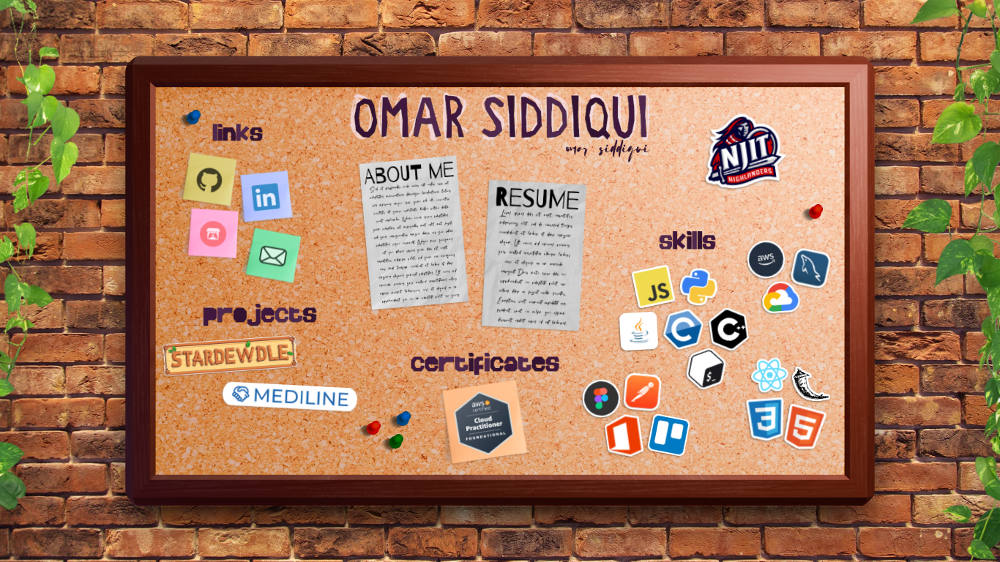

# Omar Siddiqui – Developer Portfolio

Welcome to my personal portfolio!
Here you can find my resume, and learn about me a student interested in software development.
Find my links, learn about my projects, and see my skills and certificates.
I aim to create impactful software that bridges design, functionality, and problem-solving.

##  Live Site

[www.osid.dev](https://www.osid.dev)  
(Currently deployed via Vercel)

## Screenshots

## Features

- Clean and responsive UI (built with Next.js, React, Tailwind CSS)
- Resume and About Me sections
- Interactive project gallery
- Contact links
- Skills and certificates display
- Framer Motion-based animations

## Built With

- **Framework**: React (Next.js)
- **Styling**: Tailwind CSS
- **Animation**: Framer Motion
- **Deployment**: Vercel
